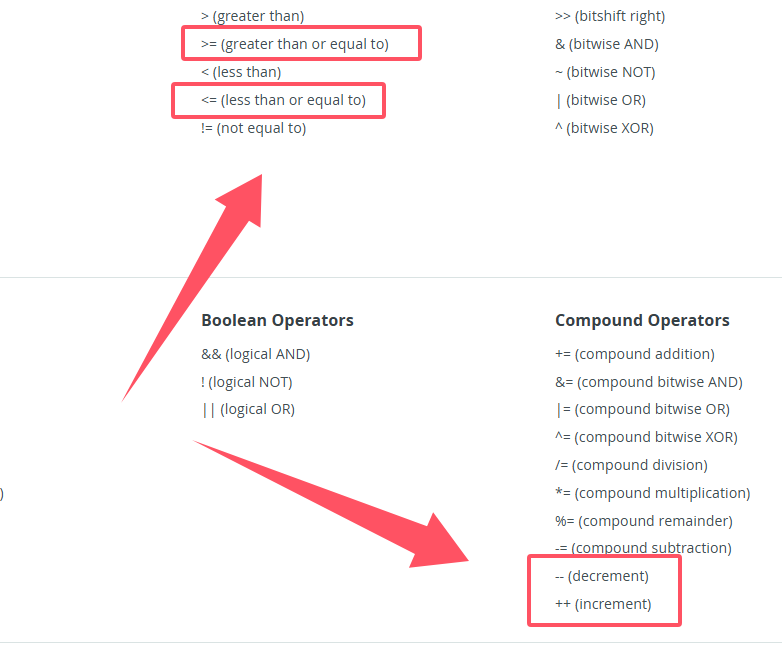
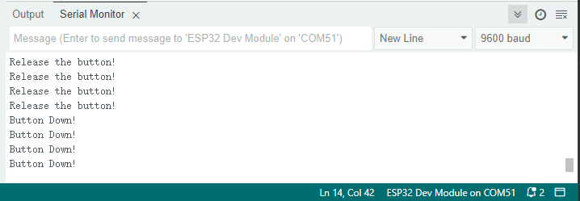
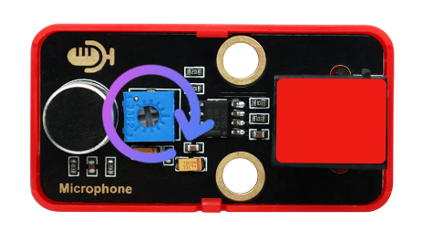

# ESP32 IoT Basic Starter Kit


## Introduction

In the Internet of Things (IoT) era, technological literacy plays an important role in children's life. So many parents and even educators focus on how to let them easily get started, understand and use IoT. 

Whereupon, we especially design this KidsIOT ESP32 IoT Basic Starter Kit, with ease of use, security and fun as its core, to open the door to the intelligent world. This kit integrates a powerful hardware configuration and a friendly programming environment, and it includes multiple sensors/modules, which helps children take their first steps to explore IoT and develop their innovative thinking and practical abilities.

**Features:**

1. **Powerful core based on ESP32**

	The core control board of the KidsIOT kit is based on the ESP32 chip that is a low-power dual-core microcontroller with Wi-Fi and Bluetooth capabilities.

2. **Safe and simple connection**

	KidsIOT adopts RJ11 interface. This easy-to-plug connection greatly simplifies the hardware setup, avoids cumbersome wiring and potential errors, which is perfect for younger children. Considering the safety of children, we avoid designing sharp edges in the kit.

3. **Compatible with Lego - inspire creativity**

	KidsIOT board and sensors are compatible with Lego, so kids can combine electronics with LEGO bricks to build creative devices.

4. **Rich sensors - boarden application**

	The kit includes multiple **sensors and modules**: temperature and humidity sensor, light sensor, sound sensors, and so on. Children can program and control them for interesting applications, such as automatic light, ambient temperature monitoring and smart alarm.

5. **Graphical programming - ease learning**

	To lower the threshold of programming learning, KidsIOT supports graphical programming, a method that codes are written by dragging blocks, rather than mastering complex syntax. So you can easily control hardware devices.

**Parameters:**

1. Operation voltage: 3.3V of main chip

2. Input voltage: 6-12V (Recommended 9V)

3. Rated current: To ensure minimum workflow, if there are multiple power inputs, they must be described separately with the power interface model description.

4. Main chip: ESP32

5. Product dimensions: 200x90x50mm 

6. Product weight: 300g

7. Operating temperature: -10℃ ~ 60℃


## Kit List

Please check the list to ensure that all parts are intact. If you find missing ones, please contact our sales staff immediately.

|#|PIC|NAME|QTY|
| :--: |:-----------------:|:------------------------------:|:----:|
|  1   |               |    kidsIOT mainboard    |   1    |
|  2   |                             |       USB cable       |   1    |
|  3   |      |     traffic light module     | 1 |
|  4   |                             |   passive buzzer   | 1 |
|  5   |              |      button module      | 1 |
|  6   |      |      tilt sensor      | 1 |
|  7   |                               |      photoresistor      | 1 |
|  8   |  |      sound sensor      | 1 |
|  9   |                             | XHT11 temperature and humidity sensor | 1 |
| 10 |  | Telephone cable | 7 |


## Development Board & Arduino IDE

Click to visit the information of the development board: [KidsIOT STEM Education Development Board — kidsbits WiKi documentation](https://wiki.kidsbits.cc/projects/KD2076/en/latest/docs/kidsIOT.html#kidsiot-stem-education-development-board)

###  IDE Download/Installation/Using Method (Driver Included)

Software version used by our developers: `Arduino IDE 2.3.3` `ESP32 2.0.12`. Note that the ESP32 version is recommended to be consistent to avoid problems such as code errors.

For `ESP32 2.0.12`, an offline package is provided to download directly. After you install Arduino IDE, click the offline package to automatically install Arduino IDE `ESP32 2.0.12` version: [ESP32 2.0.12 offline package](https://fs.keyestudio.com/ESP32)

Click to check how to download and install Arduino IDE: [KidsIOT STEM Education Development Board — kidsbits WiKi documentation](https://wiki.kidsbits.cc/projects/KD2076/en/latest/docs/kidsIOT.html#getting-started-with-arduino-ide)


## Kit Tutorial

The tutorial contains the library files of project codes.

[Click here to download](./resource.zip).


### Code Libraries

After unzipping the `resource.zip`, there are two files: `codes`(stores the project codes) and `lib`(stores the package of library files required for the projects).

For codes to work properly, it is necessary to add libraries to the Arduino IDE. How to add library files online: [KidsIOT STEM Education Development Board — kidsbits WiKi documentation](https://wiki.kidsbits.cc/projects/KD2076/en/latest/docs/kidsIOT.html#installing-an-oled-display-library)

Here we provide with a zip for you that includes library files. Therefore, we can add them offline. The detailed steps are as follows:

1. Open Arduino IDE.

2. Click `Sketch` –>`lnclude Library` –>`Add .zip Library...`

   

3. Find the folder downloaded in the link, and open `lib` to choose the required `.zip` files of the libraries. And click OK.


## Troubleshooting

1. **Error occurs when uploading programs.**

​	1.1 If the upload error occurs, check whether the development board is correct. For KidsIOT, `ESP32 Dev Module` should be selected. Besides, check whether the port is correct. If you have no idea about which COM port is, unplug the cable to see which port number disappears. 

​	1.2 If it report an error as follows, it means that libraries are not imported. For instance, as shown below, not find such file of `SimpleTimer.h`, so we need to import this library file.


​	1.3 If error is reported during uploading the code, configure the ESP32 board at: Tools -> Partition Scheme:"RainMaker".


Set `Partition Scheme:` to `RainMaker`.


2. **The product does not work.**

​	2.1 After uploading code, KidsIOT has no response and its ports are inconsistent. Please connect an external power supply as the power supply of the USB port on some computers cannot meet KidsIOT's needs for normal operation.

​	2.2 Toggle the switch on the KidsIOT to `ON`.

3. **Test results are inconsistent with that in the tutorial.**

​	3.1 Check whether the test code you upload is the same as that in the tutorial.

​	3.2 Check whether ESP32 works normally. If it is a multi modules project, you may test a single module at once. For example, project 12, the LED is not on after the button is pressed. First check whether wiring is correct and wires are properly inserted. After that, test button module referring to project 6. If it works, test traffic light module. If it works too, please consult our service persons.

4. **ESP32 is not able to connect the WiFi.**

​	4.1 Check the frequency of WiFi connected to ESP32. For now, ESP32 only supports 2.4GHz WiFi. If you are not sure whether your WiFi is 2.4GHz, open a hot spot on your phone. Note that some mobiles are 5GHz by default, so we reset it. For how to set the mobile hotspot to 2.4GHz, please see tutorials on the web according to brands and models.

​	4.2 Check you external power supply. If the batteries can be replaced, try new ones to ensure normal power supply. The power consumption of ESP32 WiFi is relatively large when working, and the USB interface of the general computers can not meet this needs, so external power supply is required.

## Projects

### Project 1 LED BLINK

**1. Overview**


The traffic light is the signals that commands the traffic operation, which is generally composed of red, green and yellow. Red indicates prohibited, green indicates permitted, and yellow indicates a warning. This traffic light module is composed of red LED, yellow LED and green LED, whose control principle is consistent with that of white LED.

**2. Parameters**

Operating voltage: DC 3.3 ~ 5V 

Operating current: 40 mA

Maximum power: 0.2 W

Operating temperature: -10°C ~ +50°C

Dimensions: 48 x 24 x 18 mm (without housing)

Positioning hole: Diameter of 4.8 mm

Interface: Telephone socket

**3. Principle**


<center>Schematic diagram of traffic light module</center>


We know from the schematic that the traffic light module is assembled by red, yellow, and green LED modules. So when we control this module, we are actually controlling LEDs.

**4. Wiring Diagram**

When using the traffic light module, connect it to white ports on the board.


Connect this module to socket 9. According to the pin sequence, the red LED is connected to pin io17, the yellow to io18, and the green to io19.

When a high level (1) is input to the pin of the module, the corresponding color lights up; When low (0) is entered, the corresponding color is off.


**5. Test Code**

For LED BLINK project, only the red LED is adopted whose control pin is IO17.

```c++
/*  
  Project name: LED_BLINK 
  Function: LED BLINK
  Author: keyestudio    
  Hardware connection:  
    - Connect RED LED to digital port 17  
  Library:  
    - none (no need to import additional library)  
  Cautions:  
    - Ensure the LED is connected to digital port IO17  
    - Before uploading test code, please correctly connect to the development board and port  
*/    
#define RED_LED_PIN 17   //Connect the red LED to port IO17
  
void setup() {  
  // Initialize the digital port to output  
  pinMode(RED_LED_PIN, OUTPUT);  
}  
  
void loop() {  
  // LED on
  digitalWrite(RED_LED_PIN, HIGH);  
  // delay 500ms  
  delay(500);  
  // LED off
  digitalWrite(RED_LED_PIN, LOW);  
  // delay 500ms  
  delay(500);  
}

```

**6. Test Result**

After uploading the test code, the red LED flashes.


**7. Code Explanation**

7.1 `#define RED_LED_PIN 17` 

#define is used to set constant (an unchanging value). Syntax: `#define constantName value`

- **constantName:** the name of the macro to define
- **value:** the value to assign to the macro

Please refer to the official website for details: [#define | Arduino Documentation](https://docs.arduino.cc/language-reference/en/structure/further-syntax/define/)

7.2 `setup()`

When executing the code, setup() function will be called to initialize variables and pin modes, or enable libraries. It only runs once each time the Arduino board is powered on or reset.

Please refer to the official website for details: [setup() | Arduino Documentation](https://docs.arduino.cc/language-reference/en/structure/sketch/setup/)

7.3 `pinMode(RED_LED_PIN, OUTPUT);`

pinMode() sets the specified pin to input / output / pull-up. Syntax: `pinMode(pin, mode)`

- **pin**: the Arduino pin number to set the mode of.
- **mode**:INPUT,OUTPUT, orINPUT_PULLUP

Please refer to the official website for details: [pinMode() | Arduino Documentation](https://docs.arduino.cc/language-reference/en/functions/digital-io/pinMode/)

7.4 `loop()`

Test codes in  ‘{  }’ of the loop() function will always be executed. They are a loop.

Please refer to the official website for details: [loop() | Arduino Documentation](https://docs.arduino.cc/language-reference/en/structure/sketch/loop/)

7.5 `digitalWrite(RED_LED_PIN,HIGH)`

digitalWrite() controls specified pins output HIGH or LOW. Syntax: `digitalWrite(pin, value)`

- **pin**: the Arduino pin number
- **value**: HIGH or LOW

Please refer to the official website for details: [digitalWrite() | Arduino Documentation](https://docs.arduino.cc/language-reference/en/functions/digital-io/digitalwrite/)

7.6 `delay(500)`

delay() is used where waiting is required in the program. Syntax: `delay(value)`

**value**: Delay time value (unit: ms), 1S = 1000mS, 1mS = 1000 uS. Generally we use mS.

Please refer to the official website for details: [delay() | Arduino Documentation](https://docs.arduino.cc/language-reference/en/functions/time/delay/)

### Project 2 PWM Control LED Brightness

**1. Overview**

The LED brightness can be controlled via voltage. There are two ways to control kidsIOT board pin output voltage: a pin output with ADC function, or use PWM(“Pulse Width Modulation”).  For kidsIOT board, all GPIO pins support PWM.

**2. Principle**

**What is PWM?**

Pulse width modulation is a solution that simulates the change of analog signals through digital ones.

Pulse width is the high level in a complete square wave cycle. So, pulse width modulation is to adjust the high level (of course, in other words, low level is also adjusted because the cycle is fixed).


- PWM frequency

  the number of times the signal going from high level to low level and back to high level in 1 second (one cycle), that is, how many cycles there are in a second.

  Unit: Hz

  Expression: 50Hz 100Hz

- PWM cycle

  $ T= \frac {1}{f}$      $ Cycle= \frac {1}{frequency}$

  If the frequency is 50Hz, the cycle will be 20ms, i.e., there are 50 PWM cycles in one second.

- PWM duty cycle

  the ratio of high level time to the whole cycle time.

  - Unit: %(1% ~ 100%)


  - Cycle: The time of a pulse signal. The number of cycles in 1s equals the frequency.
  - Pulse width time: high level time.


<center>The relationship between duty cycle and LED brightness</center>


The longer the high level time is, the greater the duty cycle will be, and the brighter the LED will be.

**3. Wiring Diagram**


**4. Test Code**

```c++
/*  
  Project name: 2_PWM_LED 
  Function: Control LED brightness, from dark to light and then from light to dark. 
  Author: keyestudio    
  Hardware connection:  
    - Connect RED LED to digital port 17  
  Library:  
    - none (no need to import additional library)  
  Cautions:  
    - Ensure the LED is connected to digital port IO17  
    - Before uploading test code, please correctly connect to the development board and port  
*/    
#define RED_LED_PIN 17   //Connect the red LED to port IO17
  
void setup() {  
   // initialize PWM
  pinMode(RED_LED_PIN,OUTPUT);
}  
  
void loop() {  
  for(int i = 0;i <= 255;i++){
    analogWrite(RED_LED_PIN,i);
    delay(10);
  }
  for(int i = 255;i >= 0;i--){
    analogWrite(RED_LED_PIN,i);
    delay(10);
  }
}

```

**5. Test Result**

After uploading the test code, the red LED goes from dark to light and then from light to dark, repeatedly.


**6. Code Explanation**

6.1 `analogWrite()`

analogWrite() function outputs analog values (PWM waves). It controls the brightness of the LED or the rotation speed of motor. After calling analogWrite(), the pin will generate a stable rectangular wave with the specified duty cycle until the function (or digitalRead() / digitalWrite()) is called next time on the same pin

Syntax: `analogWrite(pin, value)`

- **pin:** the Arduino pin to write to. Allowed data types:int
- **value:** the duty cycle: between 0 (always off) and 255 (always on). Allowed data types:int

Please refer to the official website for details: [analogWrite() | Arduino Documentation](https://docs.arduino.cc/language-reference/en/functions/analog-io/analogWrite/)

6.4 `for()`

`for` loop is used to execute codes in it for a specified number of times. `for` is especially useful for scenarios where the number of loops is known.

Here is the syntax of `for` statement:

```c
for (Initialize the expression; Conditional expression; Iterative expression) {  
      // Loop: Block of test code to be executed repeatedly
}
```

- **Initialize the expression**: Execute before the loop starts, usually to initialize one or more loop control variables.
- **Conditional expression**: Check before each iteration of the loop. If the condition is true (non-zero), the loop is executed; If it is false (zero), the loop exits.
- **Iterative expression**: Executes at the end of each loop iteration and is usually used to update loop control variables.


① Set the initial value of the loop, execute it only once, and then enter ②.

② To determine whether the loop condition is met. Here `i <= 255`, if i is less than or equal to 255, enter the loop ③.

③ Repeat the code. Put the code that needs to loop here. This code needs to control the PWM value from 0 to 255, so we just treat the value of i as PWM. Then enter ④.

④ i++ is i plus one over the original value, it equals “i = i +1”. Similarly, i- - is “i = i - 1”. After that, enter ⑤.

⑤ After adding one (or subtracting one) to the value of i, determine whether the value of i is less than or equal to 255. If yes, continue into the loop ③, if not, exit the for loop.

Please refer to the official website for details: [for | Arduino Documentation](https://docs.arduino.cc/language-reference/en/structure/control-structure/for/)

`++ , --,<= ,>=` official website operator explanation: [Language Reference | Arduino Documentation](https://docs.arduino.cc/language-reference/#structure)



### Project 3 Flowing Water LED

**1. Overview**

In this project, we light up LEDs with time difference, so they will not turn on at the same time. As the name implies, the LEDs turns on and off one by one.

**2. Wiring Diagram**

Connect this module to socket 9. According to the pin sequence, the red LED is connected to pin io17, the yellow to io18, and the green to io19.


**3. Test Code**

```c++
/*  
  Project name: 3_Flowing_light 
  Function: Control the red, yellow and green LED to show the effect of water flow
  Author: keyestudio    
  Hardware connection:  
    - Connect to port 9 
  Library:  
    - none (no need to import additional library)  
  Cautions:  
    - Ensure that connect to port 9   
    - Before uploading test code, please correctly connect to the development board and port   
*/    
#define RED_LED_PIN 17      //Connect the red LED to port IO17
#define YELLOW_LED_PIN 18   //Connect the yellow LED to port IO18
#define GREEN_LED_PIN 19    //Connect the green LED to port IO19
  
void setup() {  
  // Initialize the digital port to output  
  pinMode(RED_LED_PIN, OUTPUT);  
  pinMode(YELLOW_LED_PIN, OUTPUT);
  pinMode(GREEN_LED_PIN, OUTPUT);
}  
  
void loop() {  
  // red LED on, yellow and green LED off
  digitalWrite(RED_LED_PIN, HIGH);  
  digitalWrite(YELLOW_LED_PIN, LOW);  
  digitalWrite(GREEN_LED_PIN, LOW);  
  // Delay 300ms  
  delay(300);  
  // yellow LED on, red and green LED off
  digitalWrite(RED_LED_PIN, LOW);  
  digitalWrite(YELLOW_LED_PIN, HIGH);  
  digitalWrite(GREEN_LED_PIN, LOW);   
  // Delay 300ms  
  delay(300);  
  // green LED on, red and yellow LED off
  digitalWrite(RED_LED_PIN, LOW);  
  digitalWrite(YELLOW_LED_PIN, LOW);  
  digitalWrite(GREEN_LED_PIN, HIGH);   
  // Delay 300ms  
  delay(300);  
}

```

**4. Test Result**

After uploading the test code, the traffic light module will turn on in this order: red, yellow and green LED.


**5. Optimized Code**

C is very flexible, we parse the codes into steps to execute them. If we use 10 or more LEDs to make flowing water light, codes will be very long. So an “array” thing is combined with for loop to simplify the codes.

**Test Code:**

```c++
/*  
  Project name: 3_Flowing_light_plus
  Function: Simplify the amount of code, control the red, yellow and green LED to show flowing water effect
  Author: keyestudio    
  Hardware connection:  
    - Connect to port 9 
  Library:  
    - none (no need to import additional library)  
  Cautions:  
    - Ensure connect to port 9   
    - Before uploading test code, please correctly connect to the development board and port
    - The bit number of the array value starts from 0   
*/    

//Put the pin numbers that control the LED into the array, then LED_PIN[0] is IO17 pin, LED_PIN[1] is IO18 pin, and LED_PIN[2] is IO19 pin
int LED_PIN[] = {17,18,19}; 
  
void setup() {  
  /*
    Initialize the digital port to output
    First loop: i = 0 meets the loop condition i < 3, enter loop, LED_PIN[i] is 17
    Second loop: i++ is executed first, so the value of i is 1; i < 3, enter loop, LED_PIN[i] is 18
    Third loop: loop: i++ is executed first, so the value of i is 2; i < 3, enter loop, LED_PIN[i] is 19
    Forth loop: i++ is executed first, so the value of i is 3, which does not meet the loop condition i < 3, exit the for loop.
  */
  for(int i = 0;i < 3;i++){
    pinMode(LED_PIN[i],OUTPUT);
  }
}  
  
void loop() {  
  //flowing water light, The loop pattern is the same as the initialization pin
  for(int i = 0;i < 3;i++){
    digitalWrite(LED_PIN[i],HIGH);
    delay(300);
    digitalWrite(LED_PIN[i],LOW);
  }
}

```

**6. Code Explanation**

An array is a collection of elements of the same type: An array contains one or more elements, all of which are of the same type. Yet the number cannot be 0. 

Array is divided into one-dimensional and multidimensional array (generally two-dimensional).

**Statement:** `type arr_name [constant value]`
	**type:** What type of data does the array store
	**arr_name:** Array name
	**[constant value]:** The number of elements in the array (the size of the array)

### Project 4 Traffic Light System

**1. Overview**

Actually, we also control LEDs, but it follows the traffic rules. For example, when the green LED changes to red, the yellow LED flashes. In this project, we adopt the traffic light module to simulate traffic light system.

**2. Wiring Diagram**


**3. Test Code**

```c++
/*  
  Project name: 4_Traffic_Lights
  Function: Traffic light module simulates traffic light control
  Author: keyestudio    
  Hardware connection:  
    - Connect to port 9 
  Library:  
    - none (no need to import additional library)  
  Cautions:  
    - Ensure connect to port 9   
    - Before uploading test code, please correctly connect to the development board and port
*/

#define RED_LED_PIN 17     //Connect the red LED to port IO17
#define YELLOW_LED_PIN 18  //Connect the yellow LED to port IO18
#define GREEN_LED_PIN 19   //Connect the green LED to port IO19

void setup() {
  // Initialize the digital port to output
  pinMode(RED_LED_PIN, OUTPUT);
  pinMode(YELLOW_LED_PIN, OUTPUT);
  pinMode(GREEN_LED_PIN, OUTPUT);
}

void loop() {
  // green LED on
  digitalWrite(GREEN_LED_PIN, HIGH);
  // Delay 5000ms
  delay(5000);
  // green LED off
  digitalWrite(GREEN_LED_PIN, LOW);
  // yellow LED blinks for three times
  for (int i = 0; i < 3; i++) {
    digitalWrite(YELLOW_LED_PIN, HIGH);
    delay(500);
    digitalWrite(YELLOW_LED_PIN, LOW);
    delay(500);
  }
  // red LED on
  digitalWrite(RED_LED_PIN, HIGH);
  // Delay 5000ms
  delay(5000);
  //red LED off
  digitalWrite(RED_LED_PIN, LOW);
}

```

**4. Test Result**

After uploading the test code, the green LED lights up for 5 seconds and then the yellow LED flashes for three times. At last, the red LED turns on for 5 seconds. These action repeats.


### Project 5 Passive Buzzer


**1. Overview**

Buzzer is an integrated structure of electronic sound device, which is powered by DC voltage. In application, it is widely used in computers, printers, copiers, alarms, electronic toys, automotive electronic equipment, telephones and timers. 

Buzzers can be divided into active ones(built-in drive circuits) and passive ones(external drive) according to that whether they includes an excitation source.

Active buzzers contain oscillation source inside, which can sound at a fixed frequency once be triggered. They are convenient in program control and features high sound pressure.

Passive ones, however, do not include oscillating sources. If we directly power a passive buzzer via DC voltage, it will emit no sound. According to needs, we generally drive through square waves, whose frequency determines the sound tones.

**To sum up, The active buzzer contains a vibration source, and its sound frequency is fixed. Yet there is no vibration source inside the passive one, so it must be driven by square waves whose frequency can be changed to control sounds.**

**2. Parameters**

Operating voltage: DC 3.3 ~ 5V 

Operating temperature: -10°C ~ +50°C

Control signal: Digital signal

Dimensions: 48 x 24 x 18 mm (without housing)

Positioning hole: Diameter of 4.8 mm

Interface: Telephone socket

**3. Principle**

Music is an invisible art. It is a language that narrates emotions and thoughts. 

The foundation of music, as we all know, is note. We can compose a variety of melodies and rhythms with different notes. Of all the notes, the most basic are seven:


We can compose a variety of melodies and rhythms with these notes.

Passive buzzer module must be drive by square waves to emit sound. We can change the duty cycle of PWM to control square waves.

- The greater the duty cycle is, the lauder the sound will be.

And the tones vary from different frequency of PWM.

- The higher the frequency is, the higher the tone will be.

**Frequencies in Tone C:**

|    Note     | Frequency(Hz) |      Note      | Frequency(Hz) |     Note     | Frequency(Hz) |
| :---------: | :-----------: | :------------: | :-----------: | :----------: | :-----------: |
| Flat  1  Do |      262      | Natural  1  Do |      523      | Sharp  1  Do |     1047      |
| Flat  2  Re |      294      | Natural  2  Re |      587      | Sharp  2  Re |     1175      |
| Flat  3  Mi |      330      | Natural  3  Mi |      659      | Sharp  3  Mi |     1319      |
| Flat  4  Fa |      349      | Natural  4  Fa |      698      | Sharp  4  Fa |     1397      |
| Flat  5  So |      392      | Natural  5  So |      784      | Sharp  5  So |     1568      |
| Flat  6  La |      440      | Natural  6  La |      880      | Sharp  6  La |     1760      |
| Flat  7  Si |      494      | Natural  7  Si |      988      | Sharp  7  Si |     1967      |

**4. Wiring Diagram**

The passive buzzer is a digital module. It needs to be connected to a blue socket of the main board.


Here we connect the module to socket 3. From the port view of the kidsIOT board, socket 3 is digital port io26.


**5. Test Code**

```c++
/*  
  Project name: 5_Buzzer
  Function: buzzer plays Flat DO，Re，Mi，Fa，So，La，Si
  Author: keyestudio    
  Hardware connection:  
    - Connect to port 3 
  Library:  
    - none (no need to import additional library)  
  Cautions:  
    - Ensure connect to port 3   
    - Before uploading test code, please correctly connect to the development board and port
*/
#define beeppin 26  //Set pin to IO26

void setup() {
  pinMode(beeppin, OUTPUT);  //Set the pin to output
}

void loop() {
  tone(beeppin, 262);  //Flat DO plays 500ms
  delay(500);
  tone(beeppin, 294);  //Flat Re plays 500ms
  delay(500);
  tone(beeppin, 330);  //Flat Mi plays 500ms
  delay(500);
  tone(beeppin, 349);  //Flat Fa plays 500ms
  delay(500);
  tone(beeppin, 392);  //Flat So plays 500ms
  delay(500);
  tone(beeppin, 440);  //Flat La plays 500ms
  delay(500);
  tone(beeppin, 494);  //Flat Si plays 500ms
  delay(500);
  noTone(beeppin);  //stop playing
  delay(1000);
}

```

**6. Test Result**

After uploading the test code, the buzzer repeats the tones in sequence: Do, Re, Mi, Fa, So, La, Si.

**7. Extension**

Now that we've learned how to make the buzzer sound, let's play a song on it. Here I decided to play *Happy Birthday*. The first thing is to find a numerical score of the music:


And if we want to know whether it's high or low, we have to look at this:


**Test Code:**

```c++
/*  
  Project name: 5_Buzzer_Music
  Function: buzzer plays Happy Birthday
  Author: keyestudio    
  Hardware connection:  
    - Connect to port 3 
  Library:  
    - none (no need to import additional library)  
  Cautions:  
    - Connect to port 3   
    - Before uploading test code, please correctly connect to the development board and port
*/
#define beeppin 26  //Set pin to IO26

// do、re、mi、fa、so、la、si
int doremi[] = {262, 294, 330, 370, 392, 440, 494,      //falt(low) 0-6
                523, 587, 659, 698, 784, 880, 988,      //natural(middle) 7-13
                1047,1175,1319,1397,1568,1760,1967};    //sharp(high) 14-20

// Locate the position number in the doremi[] array based on the low, middle and high frequencies of the simplified numbers                
int happybirthday[] = {5,5,6,5,8,7,5,5,6,5,9,8,5,5,12,10,8,7,6,11,11,10,8,9,8};   
// beats
int meter[] = {1,1,2,2,2,4, 1,1,2,2,2,4, 1,1,2,2,2,2,2, 1,1,2,2,2,4};    

void setup() {
  pinMode(beeppin, OUTPUT);  //set the pin to output
}

void loop() {
  for( int i = 0 ; i <= 24 ;i++){       //i<=24: here are only 24 keys in the score
    //Emit a waveform with frequency using the tone() function
   tone(beeppin, doremi[happybirthday[i] - 1]);
   delay(meter[i] * 300); //beats
   noTone(beeppin);//stop
  }
}

```


### Project 6 Button Input

**1. Overview**


The single-way button module consists of one tap switch and one yellow button cap. We have learned how to code the board pin output high or low. Herein, we learn how to control the board pin to read high and low levels.

**2. Parameters**

Operating voltage: DC 3.3 ~ 5V 

Operating current: 1.1 mA

Maximum power: 0.0055 W

Operating temperature: -10°C ~ +50°C

Control signal: Digital signal

Dimensions: 24 x 48 x 18 mm (without housing)

Positioning hole: Diameter of 4.8 mm

Interface: Telephone socket

**3. Principle**

When using, we only need to read the digital signal of the GPIO port connected to the module, so as to determine whether the button is pressed. When it is not pressed, S end is pulled up by the VCC through the R1 resistor. So S end is at a high level. When it is pressed, S is directly connected to GND, so S is at low.


**4. Wiring Diagram**

The button module is a digital module. It needs to be connected to a blue socket of the main board.


Here we connect the module to socket 3. From the port view of the kidsIOT board, socket 3 is digital port io26.


**5. Test Code**

```c++
/*  
  Project name: 6_Button_Basic
  Function: read button state
  Author: keyestudio    
  Hardware connection:  
    - Connect to port 3 
  Library:  
    - none (no need to import additional library)  
  Cautions:  
    - Connect to port 3   
    - Before uploading test code, please correctly connect to the development board and port
    - Set the baud rate to 9600 before using serial monitor printing
*/
#define button_Pin 26  //set button pin to IO26

void setup() {
  //Set the baud rate
  Serial.begin(9600);
  //set the pin to input
  pinMode(button_Pin, INPUT);  
}

void loop() {
  //Read TTL level of pin IO26 (high level '1', low level '0')
  int button_state = digitalRead(button_Pin); 
  //Serial port print character "Button State:", no wrap
  Serial.print("Button State:"); 
  //Serial port print the value of variable `button_state`, wrap
  Serial.println(button_state);
  //Delay 300ms to observe the printed values
  delay(300); 
}

```

**6. Test Result**

After uploading the test code, Click  on the Arduino IDE and set the baud rate to `9600`. The serial monitor prints the button state. When the button is pressed, the state value is 0. When it is released, the value is 1.


**7. Extension**

Now that we have learned how to read the state of the button, how will we screen these state? `if` comes in handy. It is used to determine whether the condition is satisfied. If yes, execute the code in “{ }”; if not, exit the execution.

**Test Code:**

```c++
/*  
  Project name: 6_Button_Basic_2
  Function: read button state
  Author: keyestudio    
  Hardware connection:  
    - Connect to port 3 
  Library:  
    - none (no need to import additional library)  
  Cautions:  
    - Connect to port 3   
    - Before uploading test code, please correctly connect to the development board and port
    - Set the baud rate to 9600 before using serial monitor printing
*/
#define button_Pin 26  //set button pin to IO26

void setup() {
  //Set the baud rate
  Serial.begin(9600);
  //set the pin to input
  pinMode(button_Pin, INPUT);
}

void loop() {
  //Read TTL level of pin IO26 (high level '1', low level '0')
  int button_state = digitalRead(button_Pin);
  //determine whether the button is pressed
  if (button_state == 0) {
    //if ues, "Button Down!"
    Serial.println("Button Down!");
  } else {
    //if not, "Release the button!"
    Serial.println("Release the button!");
  }
  //Delay 300ms to limit the printing speed
  delay(300);
}

```

After uploading the test code, open the serial monitor and set the baud rate to 9600, and the serial monitor prints results. When the button is pressed, "Button Down!" is shown. If the button is released, serial monitor prints "Release the button!".



**8. Code Explanation**

8.1 `Serial.begin(9600);`

Serial.begin(9600); set the serial baud rate. Serial port printing can be performed only when the serial baud rate is consistent. 9600 and 115200 are commonly used.

8.2 `digitalRead(button_Pin);`

digitalRead(button_Pin); read TTL level of the digital pin: high (1), low (0). Syntax: `digitalRead(Pin);`

**Pin:** digital pin that needs to be read

Please refer to the official website for details: [digitalRead() | Arduino Documentation](https://docs.arduino.cc/language-reference/en/functions/digital-io/digitalread/)

8.3   `Serial.print("Button State:"); `
Serial.print(); Serial print without line wrap. When printing, enter variables or characters to be printed in parentheses (printing characters need to be placed in double quotes).

8.4 ` Serial.println(button_state);`

Serial.print(); Serial print with line wrap. When printing, enter variables or characters to be printed in parentheses (printing characters need to be placed in double quotes).

8.5 `if()  else`

if() is used to determine whether the condition is satisfied. If yes, execute the code in “{ }”; if not, execute  the code in else “{ }”.

Please refer to the official website for details: [if | Arduino Documentation](https://docs.arduino.cc/language-reference/en/structure/control-structure/if/)

### Project 7 Tilt Detection

**1. Overview**


Tilt sensor is also known as one-way ball switch, which boasts a ball inside. In the module, one end is connected and the other is not, which is used to monitor the tilt. The module outputs different level signals depending on whether the sensor is tilted. In application, it can be used for tilt detection and alarm making.

**2. Parameters**

Voltage: DC 3.3 ~ 5V 

Current: 4.2 mA

Maximum power: 0.03 W

Operating temperature: -10°C ~ +50°C

Dimensions: 32 x 24 x 18 mm (without housing)

Positioning hole: Diameter of 4.8 mm

Interface: Telephone socket

**3. Principle**

Tilt the module to make the ball roll to the pin end to conduct two pins, so the module output low; Tilt the module to make the ball roll to the other end, so two pins are not conducted and the module outputs a high level. As shown below:


<center>Schematic diagram of working principle</center>


<center>Tilt module schematic diagram</center>


**4. Wiring Diagram**

The tilt sensor is a digital module. It needs to be connected to a blue socket of the main board.


Here we connect the module to socket 2，From the port view of the kidsIOT board, socket 2 is digital io port io2.


**5. Test Code**

```c++
/*  
  Project name: 7_tilt
  Function: Read button state
  Author: keyestudio    
  Hardware connection:  
    - Connect to port 2 
  Library:  
    - none (no need to import additional library)  
  Cautions:  
    - Connect to port 2   
    - Before uploading test code, please correctly connect to the development board and port
    - Set the baud rate to 9600 before using serial monitor printing
*/
#define tilt_Pin 2  //set pin to IO2

void setup() {
  //Set the baud rate
  Serial.begin(9600);
  //set pin to input
  pinMode(tilt_Pin, INPUT);
}

void loop() {
  //Read TTL level of pin IO2 (high level '1', low level '0')
  int tilt_state = digitalRead(tilt_Pin);
  //determine whether it tilt.
  if (tilt_state == 1) {
    //if yes, print "It's tilted!"
    Serial.println("It's tilted!");
  } else {
    //if not, print "No tilt！"
    Serial.println("No tilt!");
  }
  //Delay 300 to limit the printing speed
  delay(300);
}

```

**6. Test Result**

After uploading the test code, open the serial monitor and set the baud rate to 9600, and the serial monitor prints results. When the tilt sensor detect no tilt, the on-module LED lights on and the serial monitor shows “No tilt!”. If the LED goes off, the serial monitor displays “It's tilted!”.


### Project 8 Light Intensity Read by Photoresistor

**1. Overview**


Photoresistor is an analog sensor whose resistance changes with light intensity. With this characteristic, we design circuits to convert resistance changes into voltage ones. This sensor can be applied to simulate people’s judgment of the ambient light intensity, so as to facilitate friendly interaction.

**2. Parameters**

Operating voltage: DC 3.3 ~ 5V 

Current: 0.2 mA

Maximum power: 0.001 W

Operating temperature: -10°C ~ +50°C

Output signal: analog signal

Dimensions: 24 x 32 x 18 mm (wit)

Positioning hole: Diameter of 4.8 mm

Interface: Telephone socket

**3. Principle**

The working principle of photoresistor is based on the internal photoelectric effect. The brighter the light is, the lower the resistance will be.


When the light intensity changes, the resistance value fluctuates, so the voltage detected at the signal end S also changes (0 ~ 3.3V). This voltage change is a continuously changing analog which takes any value within 0 ~ 3.3V. Our main board is able to directly process not analog signals, but digital ones, so ADC(Analog to Digital Converter) acquisition is required.

**What is ADC?**

An ADC(Analog to Digital Converter) converts analog to digital. Our board has integrated ADC acquisition, which can be used directly.

**kidsIOT ADC technical specifications**

1. Resolution: 12bit

   An n-bit ADC means that the ADC has 2ⁿ scales. A 12-bit ADC includes total $2^{12}=4096$ scales, and outputs 4096 digital values from 0 to 4095, with each scale is $\frac{3.3}{4095}≈0.00081(V)$.

2. General ADC input voltage calculation: <font face="courier New" color="black" size=6>$ Vin= \frac {AVDD_{ADC}}{2^{resolution bit}-1}*ReadData$</font> 

   $AVDD_{ADC}$: reference voltage


**4. Wiring Diagram**

The photoresistor is an analog module. It needs to be connected to a red socket of the main board.


Here we connect the module to socket 7. From the port view of the kidsIOT board, socket 7 is analog io port io35.

When light shines on the photoresistor, it outputs the value read at the moment.


**5. Test Code**

```c++
/*  
  Project name: 8_light
  Function: Read the analog value of the photoresistor
  Author: keyestudio    
  Hardware connection:  
    - Connect to port 7 
  Library:  
    - none (no need to import additional library)  
  Cautions:  
    - Connect to port 7   
    - Before uploading test code, please correctly connect to the development board and port
    - Set the baud rate to 9600 before using serial monitor printing
*/
#define light_Pin 35  //set photoresistor to IO35

void setup() {
  //Set the baud rate
  Serial.begin(9600);
  //set IO35 to input
  pinMode(light_Pin, INPUT);
}

void loop() {
  //Read the analog value of photoresistor
  int light_value = analogRead(light_Pin);
  //Print the analog value of photoresistor
  Serial.print("Analog value:");
  Serial.println(light_value);
  //Delay 300ms to observe the printed analog value
  delay(300);
}

```

**6. Test Result**

After uploading the test code, open the serial monitor and set the baud rate to 9600, and the serial monitor prints the analog values of the photoresistor. Cover the sensor with our hand to dim the ambient light, and the analog value decreases.


**7. Code Explanation**

7.1 `analogRead(light_Pin);`

We have learned the function of reading digital signals. Herein, analogRead() is a function that reads analog signals. 

Syntax: `analogRead(Pin);`

**Pin:** pin number of the read analog value

Please refer to the official website for details: [analogRead() | Arduino Documentation](https://docs.arduino.cc/language-reference/en/functions/analog-io/analogRead/)

### Project 9 Sound Detection by Microphone

**1. Overview**


The sound sensor acts as a microphone that can capture sound information in the environment.

It is consists of a sensitive capacitor microphone for detecting sound and an amplification circuit. It works based on the propagation and vibration of sound. When sound travels near the sensor, the sound wave causes the sensor to vibrate. Then, the sensor converts sound vibrations into electrical signals and sends them for further processing or analysis.

**2. Parameters**

Operating voltage: DC 3.3 ~ 5V 

Current: 15 mA

Maximum power: 0.075 W

Operating temperature: -10°C ~ +50°C

Dimensions: 48 x 24 x 18 mm

Positioning hole: Diameter of 4.8 mm

Interface: Telephone socket

**3. Principle**

When you speak loudly or play music to the MIC, these sound signals are converted into electrical ones, which are output at analog ports.

The amplifier circuit on the module amplifies the sound detected by the MIC. We can adjust the amplification by rotating the potentiometer. It is the maximum when we adjust the potentiometer clockwise to the end.



**4. Wiring Diagram**

The sound sensor is an analog module. It needs to be connected to a red socket of the main board.


Here we connect the module to socket 7. From the port view of the kidsIOT board, socket 7 is the analog port io35.


**5. Test Code**

```c++
/*  
  Project name: 9_sound
  Function: Read the analog value of the sound sensor
  Author: keyestudio    
  Hardware connection:  
    - Connect to port 7
  Library:  
    - none (no need to import additional library)  
  Cautions:  
    - Connect to port 7   
    - Before uploading test code, please correctly connect to the development board and port
    - Set the baud rate to 9600 before using serial monitor printing
*/
#define sound_Pin 35  //set pin to IO35

void setup() {
  //Set the baud rate
  Serial.begin(9600);
  //set IO35 to input
  pinMode(sound_Pin, INPUT);
}

void loop() {
  //Read the sound analog value
  int sound_value = analogRead(sound_Pin);
  //Print the sound analog value
  Serial.print("Analog value:");
  Serial.println(sound_value);
}

```

**6. Test Result**

After uploading the test code, open the serial monitor and set the baud rate to 9600, and the serial monitor prints the analog values of the sound sensor. Make some noise to the microphone, and these values changes. 

We can't add a delay to the code because the sound grabs the sound signals very quickly.


### Project 10 Temperature And Humidity Acquisition


**1. Overview**

XHT11 sensor is a low-cost and entry-level temperature and humidity sensor, which consists of a resistive humidity sensor and an NTC temperature sensor. It is designed 4-pin single-row pin and adopts single-wire serial interface, so we just add the appropriate pull-up resistance to read values. Moreover, its signal transmission distance can reach more than 20 meters.

**2. Parameters**

Operating voltage: DC 3.3 ~ 5V 

Operating current: 2.1 mA

Maximum power: 0.015 W

Humidity detection range: 5 ~ 95%RH (accuracy of ±5%RH under 25°C)

Temperature detection range: -25°C ~ +60°C

Operating temperature: -10°C ~ +50°C

Input signal: Digital signal

Dimensions: 48 x 24 x 18 mm (without housing)

Positioning hole: Diameter of 4.8 mm

Interface: Telephone socket

**3. Principle**

XHT11 adopts single-bus digital signal transmission, that is, data input and output at a pin. When the host sends a starting signal through this pin, XHT11 begins to transmit temperature and humidity data back to the host in the form of timing signals that are represented by a specific time intervals and signal levels.

**Operation process:**

A complete data transmission is 40 bits, with high bit outgoing first.

Data format: 8bit humidity integers + 8bit humidity decimals + 8bit temperature integers + 8bit temperature decimals + 8bit checksums

When transmitting correctly, checksum equals the last 8 digits of the results of “8bit humidity integers + 8bit humidity decimals + 8bit temperature integers + 8bit temperature decimals”.

Once the user MCU sends a starting signal, XHT11 switches from low-power mode to high-speed mode. After the starting signal ends, XHT11 sends a response signal. It outputs 40bit data and triggers a signal acquisition. In this case, the user can choose to read part of the data. 

At Slave mode, XHT11 triggers a temperature and humidity collection after receiving the starting signal. After that, it will be back to low-speed mode.

XHT11 does not take the initiative to collect the temperature and humidity if it receives no starting signal from the host.

**Communication process:**


The idle state of the bus is high, so the host pulls it down to wait for the XHT11 response. Note that this pull-down must last at least 18ms to ensure the starting signal is detected by XHT11. 

After receiving the starting signal from the host and waiting for its end, XHT11 sends 80us low level response signals. 

After sending the starting signal, the host waits 20-40us and then reads the response signal from XHT11, and it can switch to input mode or output high. Meanwhile, the bus is pulled up by a pull-up resistor.


The bus is at low, indicating that XHT11 sends a response signal. After that, the bus is pulled up 80us and ready to send data. 

Each bit of data starts with a 50us low time slot, and the length of the high level determines whether the data bit is 0 or 1. If the read response signal is high but XHT11 is not responding, please check wiring is connected properly.

When the last bit of data has been transmitted, XHT11 pulls down the bus by 50us. Subsequently, the bus is pulled up by a pull-up resistor to enter the idle state.

**4. Wiring Diagram**

The XHT11 temperature and humidity sensor is a digital module. It needs to be connected to a blue socket of the main board.


Here we connect the module to socket 4. From the port view of the kidsIOT board, socket 4 is the digital port io27.


**5. Test Code**

Before uploading code, import the library file of the temperature and humidity sensor to the Arduino IDE first, otherwise an error will be reported.

```c++
/*  
  Project name: 10_xht11
  Function: Read the analog value of the sound sensor
  Author: keyestudio    
  Hardware connection:  
    - Connect to port 4 
  Library:  
    - DHT-sensor-library-master
  Cautions:  
    - Connect to port 4   
    - Before uploading test code, please correctly connect to the development board and port
    - Set the baud rate to 9600 before using serial monitor printing
    - Before uploading test code, the library must be imported
*/

#include <DHT.h>
//Define the XHT11 read data pin as IO27
#define xht11_Pin 27  
//Create an instance of the DHT class named dht. The DHT class is provided by the DHT.h library for communication with the DHT11(XHT11) sensor.
//XHT11 is fully compatible with DHT11's code
DHT dht(xht11_Pin,DHT11)

void setup() {
  //Set the baud rate
  Serial.begin(9600);
  //Initialize the XHT11 sensor
  dht.begin();
}

void loop() {
  // Reading  humidity
  float h = dht.readHumidity();
  // Read temperature as Celsius (the default)
  float t = dht.readTemperature();
  // Read temperature as Fahrenheit (isFahrenheit = true)
  float f = dht.readTemperature(true);  

  // Check if any reads failed and exit early (to try again).
  if (isnan(h) || isnan(t) || isnan(f)) {
    Serial.println(F("Failed to read from DHT sensor!"));
    return;
  }

  Serial.print("Humidity: ");
  Serial.print(h);
  Serial.print("   Temperature: ");
  Serial.print(t);
  Serial.print("°C ");
  Serial.print(f);
  Serial.println("°F");
  // Wait a few seconds between measurements.
  delay(2000);
}

```

**6. Test Result**

After uploading the test code, open the serial monitor and set the baud rate to 9600, and the serial monitor prints the XHT11 sensor values, including humidity and temperature in degrees Celsius and Fahrenheit. These results refreshes every 2 seconds.


**7. Code Explanation**

7.1` #include <DHT.h>`

\#include <DHT.h> calls the DHT.h library file so that we can use the functions in it.

7.2 `DHT dht(xht11_Pin,DHT11);`

This code creates an instance of the DHT class named `dht`, which is used to input the pin and type of sensor. It is provided by DHT library that communicates with DHT11/DHT22. Here we adopts XHT11, so we enter DHT11 in the second variable (XHT11 and DHT11 code are shared).

7.3 `dht.begin();`

This code initializes the XHT11 sensor, checks whether the sensor connection is normal and whether the communication is ready.

7.4 `float h = dht.readHumidity();`

This is a function that reads the humidity. In this code, the humidity value is assigned to a float variable called `h`.

`float` represents data with decimals, while `int` is with only integers.

Please refer to the official website for details: [Language Reference | Arduino Documentation](https://docs.arduino.cc/language-reference/#variables)


7.4 `float t = dht.readTemperature();`

This is a function that reads the temperature. In this code, the temperature value is assigned to a float variable called `t`, whose unit is degree Celsius.

7.5 `float f = dht.readTemperature(true);`

It also reads the temperature value. Yet it is different from reading the temperature value above. There is a `true` in parentheses, so that the units of temperature are degrees Fahrenheit.

7.6 `isnan()`

`isnan` is a Boolean function that is used to determine whether the given value is NaN. NaN stands for a non-number and usually occurs in an arithmetic exception, such as dividing by zero or calculating infinity.

### Project 11 Characters / Icons on OLED Display

**1. Overview**

KidsIOT comes with a 0.96 inch 128x64 pixel OLED display. In this project, we'll write Arduino code to learn how to use it.

**2. Principle**

The OLED has been integrated on the development board. Its communication mode is IIC, whose communication address is 0x3C.

**How I2C works?**

The I2C bus has two signal, as well as power and ground connection.


Two signal lines:

- SDA – Bidirectional data line
- SCL – Clock signal line

Each signal line connects to two pull-up resistors that pull the bus up to the supply voltage when the bus is inactive. Please note that the supply voltage is not standard. It can be 3.3 volts or 5 volts. For some high-speed I2C, it may be a lower voltage.

This difference in power supply voltage may cause problems when you connect I2C devices that use different logic levels.

Two types of devices that can connect to I2C bus: 

- Host/Master devices
- Slave devices

Host controls the bus and provides clock signals. It requests data from the slave station separately. There can be multiple hosts on the bus, but only one can be active at any given moment.

No address is assigned to host, while slave has a sole address on the bus. They adopts 7-bit addressing, so you can have up to 128 slave devices on an I2C bus. In real life, such a large collection has never been used. It is rare to see more than a dozen I2C devices on a single bus.

An updated 10-bit addressing scheme has been implemented, which is backward compatible with the existing 7-bit one.

Commercial I2C devices are assigned addresses by NXP which maintains the bus specification. Although I2C has been open source since 2006, there is a fee to obtain slave addresses from NXP. No fee is charged for hosts or slaves for non-commercial manufacturing.

Some I2C devices are assigned multiple addresses, often varying in low address bits. They can be manually configured with different addresses, so that multiple same-typed devices to be used on a single I2C bus.

For more information about IIC communication, please Google.

**3. Test Code**

```c++
/*  
  Project name: 11_oled
  Function: OLED display characters
  Author: keyestudio    
  Hardware connection:  
    - none
  Library:  
    - Adafruit_SSD1306
    - Adafruit_GFX
  Cautions:  
    - Before uploading test code, please correctly connect to the development board and port
    - Before uploading test code, the library must be imported
*/

#include <Adafruit_GFX.h>    // Core graphics library  
#include <Adafruit_SSD1306.h> // Hardware-specific library for SSD1306  
  
// Creating SSD1306 display objects (using I2C interface) 
#define SCREEN_WIDTH 128 // OLED display width, in pixels
#define SCREEN_HEIGHT 64 // OLED displays height, in pixels
  
// Declares an SSD1306 display object  
Adafruit_SSD1306 display(SCREEN_WIDTH, SCREEN_HEIGHT, &Wire, -1);  
  
void setup() {  
  // Initialize serial communication (optional, for debugging)  
  Serial.begin(115200);  
    
  // Initialize the display, 0x3C is the I2C address
  if(!display.begin(SSD1306_SWITCHCAPVCC, 0x3C)) { 
    Serial.println(F("SSD1306 allocation failed"));  
    while(1); // quit  
  }  
    
  // Clear display buffer  
  display.clearDisplay();  
    
  // Set the text color to white
  display.setTextColor(SSD1306_WHITE);  
    
  // Set text size (1 indicates normal size)  
  display.setTextSize(1);  
    
  // Sets the start position of the text 
  display.setCursor(0,0);  

  // Displays the first line of text  
  display.println("Hello, World!");  
    
  // Move to next line (Wrap)  
  // Or you can manually set the cursor position 
  // display.setCursor(0,10); // Starting position of the second line (y coordinate can be adjusted according to font height)
    
  // Displays the second line of text 
  display.println("Hello, Keyestudio!");  
    
  // Update display content 
  display.display();  
}  
  
void loop() {  
  // no need to do anything in the loop unless you want to dynamically update the display 
}
```

**4. Test Result**

After uploading the test code, the on-board OLED displays "Hello, World!" and "Hello, Keyestudio!" on two lines.


### Project 12 Modules Interaction! Button Control LED

**1. Overview**

In this project, we control LED through the button module. The ON/OFF state of LED can be controlled by press the button (a short press), while its brightness is adjusted by pressing and holding the button (a long press). We will divide the brightness into 5 levels, so the increment of each level is 255/5=51.

How to distinguish the “short” and “long”? We program to read the press duration of the button. This interaction not only enhances the flexibility of operation, but also make it interesting. It is suitable for DIY enthusiasts and electronic production beginners in some smart home applications.

**2. Code Flow**


**3. Wiring Diagram**


**4. Test Code**

```c++
/*  
  Project name: 12_Table_amp
  Function: Button control LED on and off
  Author: keyestudio    
  Hardware connection:  
    - Connect button module to port 3
    - Connect traffic light module to port 9
  Library:  
    - none (no need to import additional library)  
  Cautions:  
    - Connect ports correctly   
    - Before uploading test code, please correctly connect to the development board and port
    - Set the baud rate to 9600 before using serial monitor printing
*/
#define button_Pin 26   //set button pin to IO26
#define RED_LED_PIN 17  //Connect the red LED to port IO17

#define redLED_PWM_Channel 1  // Red led light using PWM channel 1
#define pwmFreq 5000          // PWM frequency
#define pwmResolution 8       //Set the PWM resolution to 8 so the value range is 0-255

int brightness = 2;     //Divide the PWM 0-255 into 5 parts, each of which is 51
bool led_state = false; //Use a bool type variable to control led on and off
int value = 0;  //Used to calculate long press


void setup() {
  //set button pin to input
  pinMode(button_Pin, INPUT);
  // initialize PWM
  ledcSetup(redLED_PWM_Channel, pwmFreq, pwmResolution);
  ledcAttachPin(RED_LED_PIN, redLED_PWM_Channel);
}

void loop() {
  //Read the button state
  int button_state = digitalRead(button_Pin);
  //Use while to determine whether the button is pressed, if yes, enter the loop
  while (button_state == 0) {
    //Start adding variables, each time the value of the loop value is added by one
    value++;
    //The while loop class continues to read the button state, which is used to exit the while loop
    button_state = digitalRead(button_Pin);
    //delay 100ms
    delay(100);
    //Check whether the value is greater than 5. If yes, enter the long-press mode
    //(value is greater than 5, so it is equal to 6. with 100ms delay, this is a 600ms long press)
    if (value > 5) {
      //Clear the value to 0 for the next long press
      value = 0;
      //The brightness value is increased by one, that is, every 600ms long press, the brightness rises by one level
      brightness++;
      //We only set 5 brightness levels, so when it is greater than the maximum brightness level, the brightness level should be adjusted to 1
      if(brightness > 5) brightness = 1;
      //Output the brightness of the current brightness level. brightness*51: Because we have divided the brightness level into 5 levels (255/5=51)
      ledcWrite(redLED_PWM_Channel, brightness * 51);
      //Exit the while loop, that is, after entering the long press mode, no longer enter the short press code
      break;
    }
    //Short press: Check whether the button is released. Release the button without triggering long press code, that is, within 500ms
    if (button_state == 1) {
      //Clear the value of value to 0 for the next count
      value = 0;
      //The current led_state is reversed and copied to the led_state
      led_state = !led_state;
      //After the led_state variable is reversed, the led lights up when it is true, and the led turns off when it is false
      if (led_state) {
        //led on
        ledcWrite(redLED_PWM_Channel, brightness * 51);
      } else {
        //led off
        ledcWrite(redLED_PWM_Channel, 0);
      }
    }
  }
}

```

**5. Test Result**

After uploading the test code, we press the button to turn on/off the red LED, and press and hold the button to adjust the brightness of the LED. There are 5 levels of its brightness. The last level to stay after releasing the button is the brightness of the LED.

### Project 13 Automatic LED! Photoresistor Change Brightness

**1. Overview**

Automatic adjustment of LED brightness controlled by photoresistor is an intelligent lighting technology, which detects the ambient light intensity in real time and converts these data into electrical signals. The system will analyse and process these electrical signals according to a pre-set algorithm or logic, so as to automatically adjust the brightness of the LED.

When the ambient light is dark, the LED will automatically turn on; When the ambient light is sufficient, the LED dims accordingly. 

This automatic adjustment not only helps save energy, but also creates a more comfortable light environment for users. This adjustment is widely used in home, office and many public places.

**2. Wiring Diagram**


**3. Test Code**

```c++
/*  
  Project name: 13_Automatic_lighting
  Function: The brightness of the led is automatically adjusted by the analog value of the photoresistor
  Author: keyestudio    
  Hardware connection:  
    - Connect photoresistor to port 7
    - Connect traffic light module to port 9
  Library:  
    - none
  Cautions:  
    - Make sure you are connected to the correct port   
    - Before uploading test code, please correctly connect to the development board and port
*/
#define light_Pin 35    //connect the photoresisotr to pin IO35
#define RED_LED_PIN 17  //Connect the red LED to pin IO17

#define redLED_PWM_Channel 1  // Red led light using PWM channel 1
#define pwmFreq 5000          // PWM frequency
#define pwmResolution 8       //Set the PWM resolution to 8 so the value range is 0-255

void setup() {
  //Set IO35 to input
  pinMode(light_Pin, INPUT);
  // initialize PWM
  ledcSetup(redLED_PWM_Channel, pwmFreq, pwmResolution);
  ledcAttachPin(RED_LED_PIN, redLED_PWM_Channel);
}

void loop() {
  //read photoresisotr analog value
  int light_value = analogRead(light_Pin);
  //map photoresisotr analog value to 0-255, so value 4095 = 0; 0 = 255;
  int brightness = 255 - ((light_value * 255) / 4095);
  //Light the led according to the brightness value of the photoresistor
  ledcWrite(redLED_PWM_Channel,brightness);
  //delay 300ms
  delay(300);
}

```

**4. Test Result**

After uploading the test code, the brightness of the LED will change with ambient light intensity. The brighter the environment is, the darker the LED will light. The darker the environment is, the brighter the LED will be. 

Cover the photoresistor, and the LED gets brighter. Remove you hand and the LED dims.

### Project 14 OLED Reveal! Humidity And Temperature

**1. Overview**

The temperature and humidity are displayed on the OLED. The development board connects to the sensor and the OLED display to monitor temperature and humidity in real time.

In this project, we acquire, process and display data through programming in real time. It features high contrast and low power consumption. The high-definition of OLED enables users to visually view temperature and humidity information.

This project is suitable for classrooms, laboratories and libraries, providing a convenient and reliable solution for environmental monitoring and data analysis.

**2. Wiring Diagram**


**3. Test Code**

```c++
/*  
  Project name: 14_Environment_Detection
  Function: The OLED displays the value of temperature and humidity
  Author: keyestudio    
  Hardware connection:  
    - none
  Library:  
    - Adafruit_SSD1306
    - Adafruit_GFX
  Cautions:  
    - Before uploading test code, please correctly connect to the development board and port
    - Before uploading test code, the library must be imported
*/
#include <DHT.h>
#include <Adafruit_GFX.h>      // Core graphics library
#include <Adafruit_SSD1306.h>  // Hardware-specific library for SSD1306

//Define the XHT11 read data pin as IO27
#define xht11_Pin 27
// Creating SSD1306 display objects (using I2C interface)
#define SCREEN_WIDTH 128  // OLED display width, in pixels
#define SCREEN_HEIGHT 64  // OLED display height, in pixels

DHT dht(xht11_Pin, DHT11);

// Declare an SSD1306 display object
Adafruit_SSD1306 display(SCREEN_WIDTH, SCREEN_HEIGHT, &Wire, -1);

char str_T[10];
char str_F[10];
char str_H[10];


void setup() {
  // Initialize serial communication (optional, for debugging)
  Serial.begin(9600);
    //Initialize the XHT11 sensor
  dht.begin();

  // Initialize the display, 0x3C is the I2C address
  if (!display.begin(SSD1306_SWITCHCAPVCC, 0x3C)) {
    Serial.println(F("SSD1306 allocation failed"));
    for (;;)
      ;  // quit
  }
}

void loop() {
  // Reading  humidity
  float h = dht.readHumidity();
  // Read temperature as Celsius (the default)
  float t = dht.readTemperature();
  // Read temperature as Fahrenheit (isFahrenheit = true)
  float f = dht.readTemperature(true);

  // Check if any reads failed and exit early (to try again).
  if (isnan(h) || isnan(t) || isnan(f)) {
    Serial.println(F("Failed to read from DHT sensor!"));
    return;
  }
  //Convert the humidity value to a string and stores it in the str_H array
  dtostrf(h, 6, 2, str_H);
  //Convert the value of temperature Celsius to a string and stores it in the array str_T
  dtostrf(t, 6, 2, str_T);
  //Converts the temperature Fahrenheit to a string and stores it in the array str_F
  dtostrf(f, 6, 2, str_F);

  // Clear display buffer
  display.clearDisplay();
  // Set the text color to white
  display.setTextColor(SSD1306_WHITE);
  // Set the text size, 2 for larger
  display.setTextSize(2);
  // Set the start position of the text
  display.setCursor(0, 0);
  // The first line shows the value of humidity
  display.print("H:");
  display.print(str_H);
  display.println(" %");
  // The second line shows the value of temperature Celsius
  display.print("T:");
  display.print(str_T);
  display.println(" C");
  // The third line shows the value of temperature Fahrenheit
  display.print("F:");
  display.print(str_F);
  display.println(" F");
  // Update display content
  display.display();
  delay(2000);
}
```

**4. Test Result**

After uploading the test code, the OLED shows the temperature and humidity values. Humidity is revealed on the first line, the second line and third line displays temperature value in the unit of Degree Celsius and Fahrenheit respectively.


### Project 15 Noise! Sound Sensor Control LED

**1. Overview**

The sound sensor captures the sound signals of the surrounding environment. When the sound reaches the threshold, the red LED lights up, otherwise the green LED turns on.

In this project, the technology of sound sensing and electronic alarm is combined with high sensitivity and fast response. It is suitable for home security, warehouse monitoring and laboratory.

With simple programming and circuit connection, we can monitor sound and alarm, providing an effective technical means for security protection.

**2. Code Flow**


**3. Wiring Diagram**


**4. Test Code**

```c++
/*  
  Project name: 15_Noise_Alarm
  Function: The sound in the environment is monitored, and the red LED on the threshold is exceeded
  Author: keyestudio
  Hardware connection:
    - Connect sound sensor to port 7
    - Connect traffic light module to port 9
  Library:  
    - none (no need to import additional library)  
  Cautions:  
    - Make sure you are connected to the correct interface   
    - Before uploading test code, please correctly connect to the development board and port
*/
#define sound_Pin 35      //set sound sensor pin to IO35
#define RED_LED_PIN 17    //Connect the red LED to port IO17
#define GREEN_LED_PIN 19  //Connect the green LED to port IO19

void setup() {
  //Set the baud rate
  Serial.begin(9600);
  //set IO35 to intput
  pinMode(sound_Pin, INPUT);
  // Initialize the digital port to output
  pinMode(RED_LED_PIN, OUTPUT);
  pinMode(GREEN_LED_PIN, OUTPUT);
}

void loop() {
  //Read the sound analog value
  int sound_value = analogRead(sound_Pin);
  //Determine whether the sound analog value is greater than 200, if yes, red LED on, otherwise green LED on
  if (sound_value > 200) {
    digitalWrite(RED_LED_PIN, HIGH);
    digitalWrite(GREEN_LED_PIN, LOW);
    delay(2000);
  } else {
    digitalWrite(RED_LED_PIN, LOW);
    digitalWrite(GREEN_LED_PIN, HIGH);
  }
}

```

**5. Test Result**

After uploading the test code, if the ambient sound value exceeds 200, the red LED will turn on for two seconds, otherwise the green LED will turn on.

### Project 16 Alarm! Tilt Sensor Against Theft

**1. Overview**

The tilt sensor is adopted to the anti-theft alarm project.

When object (such as a door or a window) tilts or moves, the ball rolls due to gravity to trigger the switch, which in turn activates the alarm system, such as a buzzer or LED indicator.

With simple structure, convenient installation and adjustable sensitivity, it is suitable for anti-theft alarm in home, office and shop doors, which effectively improves the security defence capability to detect and prevent potential intrusions in time.

**2. Code Flow**


**3. Wiring Diagram**                                                                                                                                                                                                                                                                                                                                                                                                                                                                                                                                           


**4. Test Code**

```c++
/*  
  Project name: 16_Tilt_Alarm
  Function: Monitor whether the plane is tilted, if yes, red LED on and the buzzer alarms, if not, the green LED on and the buzzer does not sound
  Author: keyestudio    
  Hardware connection:  
    - Connect tilt senser to port 2
    - Connect traffic light module to port 9
    - Connect buzzer to port 3
  Library:  
    - none (no need to import additional library)  
  Cautions:  
    - Make sure you are connected to the correct interface   
    - Before uploading test code, please correctly connect to the development board and port
*/
#define tilt_Pin 2        //set button pin to IO2
#define beeppin 26        //Set pin to IO26
#define RED_LED_PIN 17    //Connect the red LED to port IO17
#define GREEN_LED_PIN 19  //Connect the green LED to port IO19

void setup() {
  //Set pin modes
  pinMode(tilt_Pin, INPUT);
  pinMode(RED_LED_PIN, OUTPUT);
  pinMode(GREEN_LED_PIN, OUTPUT);
  pinMode(beeppin, OUTPUT);  
  Serial.begin(9600);
}

void loop() {
  //Read TTL level of pin IO2 (high level '1', low level '0')
  int tilt_state = digitalRead(tilt_Pin);
  Serial.println(tilt_state);
  //Determine whether to tilt
  if (tilt_state == 1) {
    //If it tilts, the red LED on, the buzzer alerts
    digitalWrite(RED_LED_PIN, HIGH);
    digitalWrite(GREEN_LED_PIN, LOW);
    tone(beeppin,384);
    delay(500);

  } else {
    //If there is no tilt, the green LED on, the buzzer does not sound
    digitalWrite(RED_LED_PIN, LOW);
    digitalWrite(GREEN_LED_PIN, HIGH);
    noTone(beeppin);
  }
}

```

**5. Test Result**

After uploading the test code, when there is no tilt, the LED on the tilt sensor and the green LED turn on, and the sound sensor stays quiet. When tilt is detected, the LED on the tilt module is off, and the red LED is on, and the sound sensor emit sound.

### Project 17 Cloud Data! Humidity And Temperature

**1. Overview**

The IoT cloud upload project of temperature and humidity data collects ambient temperature and humidity data in real time by integrating temperature and humidity sensors and Internet of Things technology, and upload it to the cloud server.

In this project, we integrate IoT cloud technology with the temperature and humidity sensor to collect the values in real time and then save to cloud.

Users can remotely monitor data changes through mobile APP or web pages and manage environment state in real time.

Beyond that, it not only improves the accuracy and timeliness of data acquisition, but also supports historical data query and abnormal alarm through cloud storage and analysis. It is widely applied to environmental monitoring for fields of agriculture, warehousing and home furnishing.

**2. Download Remote Control APP**

**Android system:**

Search `ESP RainMaker` in Google and click install. Log in an account, if you do not have the corresponding account you need to register one. 


**ios system:**

Search `ESP RainMaker` in App Store, log in your account to download it.


**3. Wiring Diagram**


**4. Test Code**

Before uploading test code, set Partition Scheme to “RainMaker”.


```c++
/*  
  Project name: 17_xht11_iot
  Function: Remote monitoring of temperature and humidity data
  Author: keyestudio    
  Hardware connection:  
    - Connect to port 4
  Library:  
    - SimpleTimer.h 
  Develop software version:  
    - It is recommended to use the same software version as the one used at the time of development to avoid incompatibility
    - Arduino IDE 2.3.3
    - ESP32 2.0.12
  Cautions:  
    - Make sure you are connected to the correct interface   
    - Before uploading test code, please correctly connect to the development board and port
    - Set ESP32 Tools -> Partition Scheme:"RainMaker"
*/
#include "RMaker.h"
#include "WiFi.h"
#include "WiFiProv.h"
#include <DHT.h>
#include <SimpleTimer.h>

SimpleTimer Timer;

//Define the XHT11 read data at pin IO27
#define xht11_Pin 27
DHT dht(xht11_Pin, DHT11);

static uint8_t gpio_reset = 0;  // Press BOOT to reset WiFi Details

// define the Node Name
char nodeName[] = "Keyes_ESP32_SmartHome";

//Here you can modify the name and key of the Bluetooth you want
const char *service_name = "keyestudio";
const char *pop = "keyes123";

// define the Chip Id
uint32_t espChipId = 5;

float temperature1 = 0;
float humidity1 = 0;


static TemperatureSensor temperature("Temperature");
static TemperatureSensor humidity("Humidity");

void sysProvEvent(arduino_event_t *sys_event) {
  switch (sys_event->event_id) {
    case ARDUINO_EVENT_PROV_START:
#if CONFIG_IDF_TARGET_ESP32
      Serial.printf("\nProvisioning Started with name \"%s\" and PoP \"%s\" on BLE\n", service_name, pop);
      printQR(service_name, pop, "ble");
#else
      Serial.printf("\nProvisioning Started with name \"%s\" and PoP \"%s\" on SoftAP\n", service_name, pop);
      printQR(service_name, pop, "softap");
#endif
      break;
    case ARDUINO_EVENT_WIFI_STA_CONNECTED:
      Serial.printf("\nConnected to Wi-Fi!\n");
      break;
  }
}

void readSensor() {

  float h = dht.readHumidity();
  float t = dht.readTemperature();  // or dht.readTemperature(true) for Fahrenheit

  if (isnan(h) || isnan(t)) {
    Serial.println("Failed to read from DHT sensor!");
    return;
  } else {
    humidity1 = h;
    temperature1 = t;
  }
}

void sendSensor() {
  readSensor();
  temperature.updateAndReportParam("Temperature", temperature1);
  humidity.updateAndReportParam("Temperature", humidity1);
}

void setup() {
  // put your setup code here, to run once:
  Serial.begin(115200);

  pinMode(gpio_reset, INPUT);

  dht.begin();  // Enabling DHT sensor

  Node my_node;
  my_node = RMaker.initNode(nodeName);

  my_node.addDevice(temperature);
  my_node.addDevice(humidity);

  Timer.setInterval(10000);  //send Data after every 10 seconds
  delay(1000);

  //This is optional
  RMaker.enableOTA(OTA_USING_PARAMS);
  //If you want to enable scheduling, set time zone for your region using setTimeZone().
  //The list of available values are provided here https://rainmaker.espressif.com/docs/time-service.html
  //RMaker.setTimeZone("Asia/Shanghai");
  // Alternatively, enable the Timezone service and let the phone apps set the appropriate timezone
  RMaker.enableTZService();
  RMaker.enableSchedule();

  Serial.printf("\nStarting ESP-RainMaker\n");
  RMaker.start();


  WiFi.onEvent(sysProvEvent);
#if CONFIG_IDF_TARGET_ESP32
  WiFiProv.beginProvision(WIFI_PROV_SCHEME_BLE, WIFI_PROV_SCHEME_HANDLER_FREE_BTDM, WIFI_PROV_SECURITY_1, pop, service_name);
#else
  WiFiProv.beginProvision(WIFI_PROV_SCHEME_SOFTAP, WIFI_PROV_SCHEME_HANDLER_NONE, WIFI_PROV_SECURITY_1, pop, service_name);
#endif
}

void loop() {
  // put your main code here, to run repeatedly:
  // Read GPIO0 (external button to reset device
  if (digitalRead(gpio_reset) == LOW) {  //Push button pressed
    Serial.printf("Reset Button Pressed!\n");
    // Key debounce handling
    delay(100);
    int startTime = millis();
    while (digitalRead(gpio_reset) == LOW) delay(50);
    int endTime = millis();

    if ((endTime - startTime) > 10000) {
      // If key pressed for more than 10secs, reset all
      Serial.printf("Reset to factory.\n");
      RMakerFactoryReset(2);
    } else if ((endTime - startTime) > 3000) {
      Serial.printf("Reset Wi-Fi.\n");
      // If key pressed for more than 3secs, but less than 10, reset Wi-Fi
      RMakerWiFiReset(2);
    }
  }
  delay(100);

  if (WiFi.status() == WL_CONNECTED) {
    //Serial.println("WiFi Connected");
    if (Timer.isReady()) {
      Serial.println("Sending Sensor Data");
      sendSensor();
      Timer.reset();  // Reset a second timer
    }
  }
}

```

**5. Test Result**

After uploading the test code, open the serial monitor and set the baud rate to 112500. Press BOOT button on the development board and hold it for 4 seconds:


Wait for the serial monitor to print a QR code for the connection:


Copy it to browser to get another QR code:


Open the ESP RainMaker APP to log in and click `Add Device`. Then the system prompts for permission of camera, location, and nearby device. You need to authorize them. 

The wifi connection for the ESP32 is sent via Bluetooth, so we need to scan the QR code on the browser to pair it with Bluetooth. 

Bluetooth name and pairing key are `keyestudio` and `keyes123`, which can be modified as you like.

```c++
const char *service_name = "keyestudio";
const char *pop = "keyes123";
```

Wifi scanning will be performed after Bluetooth pairing. For ESP32, you can either choose a scanned wifi, or click `Join Other Network` to add a Wifi manually (Note that this wifi band must be 2.4G which is same as ESP32’s). 

Then click `Start`.


Wait for successful configuration and click `Done`, and the temperature and humidity values are shown on the web page. Slide down the page to refresh them.


Note if the operation fails, you need to start from scratch. 

### Project 18 IOT! Remote Control LED

**1. Overview**

In this project, with Internet of Things, we remote control the LED through mobile APP or web page. Users can view the status of the LED anytime and anywhere, and even turn on or off it.

The experiment integrates the Internet of Things communication and remote control, featuring simple operation, rapid response, and wide coverage.

In application, it is suitable for smart home, office and many public places. It provides users with a more convenient and efficient lighting control, and contributes to energy saving and emission reduction.

**2. Wiring Diagram**


**3. Test Code**

```c++
/*  
  Project name: 18_led_iot
  Function: Remote control led on and off
  Author: keyestudio    
  Hardware connection:  
    - Connect to port 9
  Library:  
    - none (no need to import additional library)  
  Develop software version:  
      It is recommended to use the same software version as the one used at the time of development to avoid incompatibility
    - Arduino IDE 2.3.3
    - ESP32 2.0.12
  Cautions:  
    - Make sure you are connected to the correct interface   
    - Before uploading test code, please correctly connect to the development board and port
    - Set ESP32 Tools -> Partition Scheme:"RainMaker"
*/

#include "RMaker.h"
#include "WiFi.h"
#include "WiFiProv.h"

// define the Node Name
char nodeName[] = "Keyes_ESP32_SmartHome";
//Set the Bluetooth name and key
const char *service_name = "keyestudio1";
const char *pop = "keyes123";

// define the Chip Id
uint32_t espChipId = 5;

// define the Device Names
char deviceName_1[] = "redLED";
char deviceName_2[] = "yellowLED";
char deviceName_3[] = "greenLED";
//define pins
static uint8_t redLEDPin = 17;     //IO17
static uint8_t yellowLEDPin = 18;  //IO18
static uint8_t greenLEDPin = 19;   //IO19
static uint8_t gpio_reset = 0;     // Press BOOT to reset WiFi Details

int red_LED_Light = 255;
int yellow_LED_Light = 255;
int green_LED_Light = 255;

// RLED State, Used to switch the LED status
bool redState = true;
bool yellowState = true;
bool greenState = true;

//The framework provides some standard device types like switch, lightbulb, temperature sensor.
static LightBulb my_switch1(deviceName_1, &redLEDPin);
static LightBulb my_switch2(deviceName_2, &yellowLEDPin);
static LightBulb my_switch3(deviceName_3, &greenLEDPin);

void sysProvEvent(arduino_event_t *sys_event) {
  switch (sys_event->event_id) {
    case ARDUINO_EVENT_PROV_START:
#if CONFIG_IDF_TARGET_ESP32
      Serial.printf("\nProvisioning Started with name \"%s\" and PoP \"%s\" on BLE\n", service_name, pop);
      printQR(service_name, pop, "ble");
#else
      Serial.printf("\nProvisioning Started with name \"%s\" and PoP \"%s\" on SoftAP\n", service_name, pop);
      printQR(service_name, pop, "softap");
#endif
      break;
    case ARDUINO_EVENT_WIFI_STA_CONNECTED:
      Serial.printf("\nConnected to Wi-Fi!\n");
      break;
  }
}

//Read data from the server
void write_callback(Device *device, Param *param, const param_val_t val, void *priv_data, write_ctx_t *ctx) {
  const char *device_name = device->getDeviceName();
  const char *param_name = param->getParamName();

  if (strcmp(device_name, deviceName_1) == 0) {
    if (strcmp(param_name, "Power") == 0) {
      redState = val.val.b;
      (redState == false) ? analogWrite(redLEDPin, 0) : analogWrite(redLEDPin, red_LED_Light);
      param->updateAndReport(val);
    }
    //Callback brightness value - Test
    if (strcmp(param_name, "redLED_light") == 0) {
      red_LED_Light = val.val.i;
      if (redState == 1) {
        analogWrite(redLEDPin, red_LED_Light);
      }
      param->updateAndReport(val);
    }
  } else if (strcmp(device_name, deviceName_2) == 0) {
    if (strcmp(param_name, "Power") == 0) {
      yellowState = val.val.b;
      (yellowState == false) ? analogWrite(yellowLEDPin, 0) : analogWrite(yellowLEDPin, yellow_LED_Light);
      param->updateAndReport(val);
    }
    //Callback brightness value
    if (strcmp(param_name, "yellowLED_light") == 0) {
      yellow_LED_Light = val.val.i;
      if (yellowState == 1) {
        analogWrite(yellowLEDPin, yellow_LED_Light);
      }
      param->updateAndReport(val);
    }

  } else if (strcmp(device_name, deviceName_3) == 0) {
    if (strcmp(param_name, "Power") == 0) {
      greenState = val.val.b;
      (greenState == false) ? analogWrite(greenLEDPin, 0) : analogWrite(greenLEDPin, green_LED_Light);
      param->updateAndReport(val);
    }
    //Callback brightness value
    if (strcmp(param_name, "greenLED_light") == 0) {
      green_LED_Light = val.val.i;
      if (greenState == 1) {
        analogWrite(greenLEDPin, green_LED_Light);
      }
      param->updateAndReport(val);
    }
  }
}

void setup() {
  // put your setup code here, to run once:
  Serial.begin(115200);
  // PWM pin initialization
  pinMode(redLEDPin,OUTPUT);
  pinMode(yellowLEDPin,OUTPUT);
  pinMode(greenLEDPin,OUTPUT);
  //The initial state of the led is on
  analogWrite(redLEDPin, red_LED_Light);
  analogWrite(yellowLEDPin, yellow_LED_Light);
  analogWrite(greenLEDPin, green_LED_Light);

  Node my_node;
  my_node = RMaker.initNode(nodeName);


  //Standard switch device
  my_switch1.addCb(write_callback);
  my_switch2.addCb(write_callback);
  my_switch3.addCb(write_callback);

  //Add led slider block
  Param red_LED("redLED_light", ESP_RMAKER_PARAM_RANGE, value(0), PROP_FLAG_READ | PROP_FLAG_WRITE);
  red_LED.addBounds(value(0), value(255), value(100));
  red_LED.addUIType(ESP_RMAKER_UI_SLIDER);
  my_switch1.addParam(red_LED);

  Param yellow_LED("yellowLED_light", ESP_RMAKER_PARAM_RANGE, value(0), PROP_FLAG_READ | PROP_FLAG_WRITE);
  yellow_LED.addBounds(value(0), value(255), value(100));
  yellow_LED.addUIType(ESP_RMAKER_UI_SLIDER);
  my_switch2.addParam(yellow_LED);

  Param green_LED("greenLED_light", ESP_RMAKER_PARAM_RANGE, value(0), PROP_FLAG_READ | PROP_FLAG_WRITE);
  green_LED.addBounds(value(0), value(255), value(100));
  green_LED.addUIType(ESP_RMAKER_UI_SLIDER);
  my_switch3.addParam(green_LED);


  //Add switch device to the node
  my_node.addDevice(my_switch1);
  my_node.addDevice(my_switch2);
  my_node.addDevice(my_switch3);

  delay(1000);

  //This is optional
  RMaker.enableOTA(OTA_USING_PARAMS);
  //If you want to enable scheduling, set time zone for your region using setTimeZone().
  //The list of available values are provided here https://rainmaker.espressif.com/docs/time-service.html
  // RMaker.setTimeZone("Asia/Shanghai");
  // Alternatively, enable the Timezone service and let the phone apps set the appropriate timezone
  RMaker.enableTZService();
  RMaker.enableSchedule();

  Serial.printf("\nStarting ESP-RainMaker\n");
  RMaker.start();

  WiFi.onEvent(sysProvEvent);
#if CONFIG_IDF_TARGET_ESP32
  WiFiProv.beginProvision(WIFI_PROV_SCHEME_BLE, WIFI_PROV_SCHEME_HANDLER_FREE_BTDM, WIFI_PROV_SECURITY_1, pop, service_name);
#else
  WiFiProv.beginProvision(WIFI_PROV_SCHEME_SOFTAP, WIFI_PROV_SCHEME_HANDLER_NONE, WIFI_PROV_SECURITY_1, pop, service_name);
#endif
}

void loop() {
  // Read GPIO0 (external button to reset device
  if (digitalRead(gpio_reset) == LOW) {  //Push button pressed
    Serial.printf("Reset Button Pressed!\n");
    // Key debounce handling
    delay(100);
    int startTime = millis();
    while (digitalRead(gpio_reset) == LOW) delay(50);
    int endTime = millis();

    if ((endTime - startTime) > 10000) {
      // If key pressed for more than 10secs, reset all
      Serial.printf("Reset to factory.\n");
      RMakerFactoryReset(2);
    } else if ((endTime - startTime) > 3000) {
      Serial.printf("Reset Wi-Fi.\n");
      // If key pressed for more than 3secs, but less than 10, reset Wi-Fi
      RMakerWiFiReset(2);
    }
  }
  delay(100);
}

```

**4. Test Result**

After uploading the test code, all LEDs on the traffic light module turn on. Connect to `ESP RainMaker` APP according to the procedures in `Project 17`. After connecting, there will be three buttons on the APP page which control the state of LED. Tap ang one to remote control the ON/OFF state and brightness of the corresponding LED.


We demonstrate on red LED. 

How to control LED via `ESP RainMaker` App? Tap  to turn on/off the LED. Click the “redLED” part  and you will see a sliding block under “redLED_light”. Slide it to adjust its brightness. The above “Power” button can also be used to turn on/off LED.


### Project 19 Comprehension! Smart Home Environment Monitoring

**1. Overview**

With IoT, the smart home environment monitoring system integrates LED, buzzer, temperature and humidity sensor and photoresistor to monitor environment in all aspects. 

It optimize the LED brightness for a comfort indoor light condition; it alarms via buzzer when the temperature and humidity are abnormal; it also ensures lighting by the photoresistor.

Due to these, this system not only improves the comfort, safety and convenience of the home, but also realizes intelligent energy saving, which is an ideal choice for modern smart homes. It is an intelligent experience to family life.

**2. Wiring Diagram**


**3. Test Code**

```c++
/*  
  Project name: 19_Smart_Home
  Function: Remote control led and buzzer, remote read environment brightness, humidity, temperature.
  Author: keyestudio    
  Hardware connection:  
    - Connect traffic light module to port 9
    - Connect temperature and humidity module to port 4
    - Connect buzzer to port 3
    - Connect photoresistor to port 7
  Library:  
    - SimpleTimer.h
  Develop software version:  
      It is recommended to use the same software version as the one used at the time of development to avoid incompatibility
    - Arduino IDE 2.3.3
    - ESP32 2.0.12
  Cautions:  
    - Make sure you are connected to the correct interface   
    - Before uploading test code, please correctly connect to the development board and port
    - Set ESP32 Tools -> Partition Scheme:"RainMaker"
*/

#include "RMaker.h"
#include "WiFi.h"
#include "WiFiProv.h"
#include <DHT.h>
#include <SimpleTimer.h>

// define the Node Name
char nodeName[] = "Keyes_ESP32_SmartHome";

// define the Device Names
char deviceName_1[] = "redLED";
char deviceName_2[] = "yellowLED";
char deviceName_3[] = "greenLED";
char deviceName_4[] = "buzzer";

// Preferences pref;
SimpleTimer Timer;

const char *service_name = "keyes";
const char *pop = "keyes123";

// define the Chip Id
uint32_t espChipId = 5;

//define pins
static uint8_t redLEDPin = 17;     //IO17
static uint8_t yellowLEDPin = 18;  //IO18
static uint8_t greenLEDPin = 19;   //IO19
static uint8_t buzzerPin = 26;     //IO26
static uint8_t lightPin = 35;      //IO35
static uint8_t gpio_reset = 0;     // Press BOOT to reset WiFi Details
static uint8_t DHTPIN = 27;        //RX2  pin connected with DHT

//led brightness
int red_LED_Light = 255;
int yellow_LED_Light = 255;
int green_LED_Light = 255;

// LED State, Used to switch the LED status
bool redState = true;
bool yellowState = true;
bool greenState = true;

float temperature1 = 0;
float humidity1 = 0;
float lightValue = 0;
int wifiFlag = 0;
bool first_run = true;

DHT dht(DHTPIN, DHT11);

//The framework provides some standard device types like switch, lightbulb, temperature sensor.
static LightBulb my_switch1(deviceName_1, &redLEDPin);
static LightBulb my_switch2(deviceName_2, &yellowLEDPin);
static LightBulb my_switch3(deviceName_3, &greenLEDPin);
static Switch my_switch4(deviceName_4, &buzzerPin);
static TemperatureSensor temperature("Temperature");
static TemperatureSensor humidity("Humidity");
static TemperatureSensor light("Light");

void sysProvEvent(arduino_event_t *sys_event) {
  switch (sys_event->event_id) {
    case ARDUINO_EVENT_PROV_START:
#if CONFIG_IDF_TARGET_ESP32
      Serial.printf("\nProvisioning Started with name \"%s\" and PoP \"%s\" on BLE\n", service_name, pop);
      printQR(service_name, pop, "ble");
#else
      Serial.printf("\nProvisioning Started with name \"%s\" and PoP \"%s\" on SoftAP\n", service_name, pop);
      printQR(service_name, pop, "softap");
#endif
      break;
    case ARDUINO_EVENT_WIFI_STA_CONNECTED:
      Serial.println("Connected to Wi-Fi!");
      break;
  }
}

//Read data from the server
void write_callback(Device *device, Param *param, const param_val_t val, void *priv_data, write_ctx_t *ctx) {
  const char *device_name = device->getDeviceName();
  const char *param_name = param->getParamName();

  if (strcmp(device_name, deviceName_1) == 0) {
    if (strcmp(param_name, "Power") == 0) {
      redState = val.val.b;
      (redState == false) ? analogWrite(redLEDPin, 0) : analogWrite(redLEDPin, red_LED_Light);
      param->updateAndReport(val);
    }
    //Callback brightness value
    if (strcmp(param_name, "redLED_light") == 0) {
      red_LED_Light = val.val.i;
      if (redState == 1) {
        analogWrite(redLEDPin, red_LED_Light);
      }
      param->updateAndReport(val);
    }
  } else if (strcmp(device_name, deviceName_2) == 0) {
    if (strcmp(param_name, "Power") == 0) {
      yellowState = val.val.b;
      (yellowState == false) ? analogWrite(yellowLEDPin, 0) : analogWrite(yellowLEDPin, yellow_LED_Light);
      param->updateAndReport(val);
    }
    //Callback brightness value
    if (strcmp(param_name, "yellowLED_light") == 0) {
      yellow_LED_Light = val.val.i;
      if (yellowState == 1) {
        analogWrite(yellowLEDPin, yellow_LED_Light);
      }
      param->updateAndReport(val);
    }

  } else if (strcmp(device_name, deviceName_3) == 0) {
    if (strcmp(param_name, "Power") == 0) {
      greenState = val.val.b;
      (greenState == false) ? analogWrite(greenLEDPin, 0) : analogWrite(greenLEDPin, green_LED_Light);
      param->updateAndReport(val);
    }
    //Callback brightness value
    if (strcmp(param_name, "greenLED_light") == 0) {
      green_LED_Light = val.val.i;
      if (greenState == 1) {
        analogWrite(greenLEDPin, green_LED_Light);
      }
      param->updateAndReport(val);
    }

  } else if (strcmp(device_name, deviceName_4) == 0) {
    if (strcmp(param_name, "Power") == 0) {
      tone(buzzerPin, 384, 500);
      noTone(buzzerPin);
      param->updateAndReport(val);
    }
  }
}
void readSensor() {

  float h = dht.readHumidity();
  float t = dht.readTemperature();  // or dht.readTemperature(true) for Fahrenheit
  //scale down the range of photoresistor to 0-100
  lightValue = map(analogRead(lightPin), 0, 4095, 0, 100);

  if (isnan(h) || isnan(t)) {
    Serial.println("Failed to read from DHT sensor!");
    return;
  } else {
    humidity1 = h;
    temperature1 = t;
  }
}

void sendSensor() {
  readSensor();
  temperature.updateAndReportParam("Temperature", temperature1);
  humidity.updateAndReportParam("Temperature", humidity1);
  light.updateAndReportParam("Temperature", lightValue);
}


void setup() {
  Serial.begin(115200);

  pinMode(buzzerPin, OUTPUT);
  pinMode(gpio_reset, INPUT);
  pinMode(lightPin, INPUT);
  pinMode(redLEDPin, OUTPUT);
  pinMode(yellowLEDPin, OUTPUT);
  pinMode(greenLEDPin, OUTPUT);

  analogWrite(redLEDPin, 255);
  analogWrite(yellowLEDPin, 255);
  analogWrite(greenLEDPin, 255);

  dht.begin();  // Enabling DHT sensor

  Node my_node;
  my_node = RMaker.initNode(nodeName);

  //Standard switch device
  my_switch1.addCb(write_callback);
  my_switch2.addCb(write_callback);
  my_switch3.addCb(write_callback);
  my_switch4.addCb(write_callback);

  //led light slider block
  Param red_LED("redLED_light", ESP_RMAKER_PARAM_RANGE, value(0), PROP_FLAG_READ | PROP_FLAG_WRITE);
  red_LED.addBounds(value(0), value(255), value(100));
  red_LED.addUIType(ESP_RMAKER_UI_SLIDER);
  my_switch1.addParam(red_LED);

  Param yellow_LED("yellowLED_light", ESP_RMAKER_PARAM_RANGE, value(0), PROP_FLAG_READ | PROP_FLAG_WRITE);
  yellow_LED.addBounds(value(0), value(255), value(100));
  yellow_LED.addUIType(ESP_RMAKER_UI_SLIDER);
  my_switch2.addParam(yellow_LED);

  Param green_LED("greenLED_light", ESP_RMAKER_PARAM_RANGE, value(0), PROP_FLAG_READ | PROP_FLAG_WRITE);
  green_LED.addBounds(value(0), value(255), value(100));
  green_LED.addUIType(ESP_RMAKER_UI_SLIDER);
  my_switch3.addParam(green_LED);

  //Add switch device to the node
  my_node.addDevice(my_switch1);
  my_node.addDevice(my_switch2);
  my_node.addDevice(my_switch3);
  my_node.addDevice(my_switch4);
  my_node.addDevice(temperature);
  my_node.addDevice(humidity);
  my_node.addDevice(light);
  //send Data after every 30 seconds
  Timer.setInterval(30000);
  delay(1000);

  RMaker.enableOTA(OTA_USING_PARAMS);
  RMaker.enableTZService();
  RMaker.enableSchedule();

  Serial.println("Starting ESP-RainMaker");
  RMaker.start();

  WiFi.onEvent(sysProvEvent);
#if CONFIG_IDF_TARGET_ESP32
  WiFiProv.beginProvision(WIFI_PROV_SCHEME_BLE, WIFI_PROV_SCHEME_HANDLER_FREE_BTDM, WIFI_PROV_SECURITY_1, pop, service_name);
#else
  WiFiProv.beginProvision(WIFI_PROV_SCHEME_SOFTAP, WIFI_PROV_SCHEME_HANDLER_NONE, WIFI_PROV_SECURITY_1, pop, service_name);
#endif

  delay(200);
  tone(buzzerPin, 384, 1000);
  noTone(buzzerPin);
}

void loop() {
  // Read GPIO0 (external button to reset device
  if (digitalRead(gpio_reset) == LOW) {  //Push button pressed
    Serial.println("Reset Button Pressed!");
    // Key debounce handling
    delay(100);
    int startTime = millis();
    while (digitalRead(gpio_reset) == LOW) delay(50);
    int endTime = millis();

    if ((endTime - startTime) > 10000) {
      // If key pressed for more than 10secs, reset all
      Serial.println("Reset to factory.");
      RMakerFactoryReset(2);
    } else if ((endTime - startTime) > 3000) {
      Serial.println("Reset Wi-Fi.");
      // If key pressed for more than 3secs, but less than 10, reset Wi-Fi
      RMakerWiFiReset(2);
    }
  }
  delay(100);
  if (WiFi.status() == WL_CONNECTED) {
    if (Timer.isReady()) {
      Serial.println("Sending Sensor Data");
      sendSensor();
      Timer.reset();  // Reset a second timer
    }
  }
}
```

**4. Test Result**

After uploading the test code, you can control the LED and buzzer via ESP RAinMaker APP. Besides, the ambient light intensity and temperature and humidity values are shown on the page. These values are updated every half minutes.


